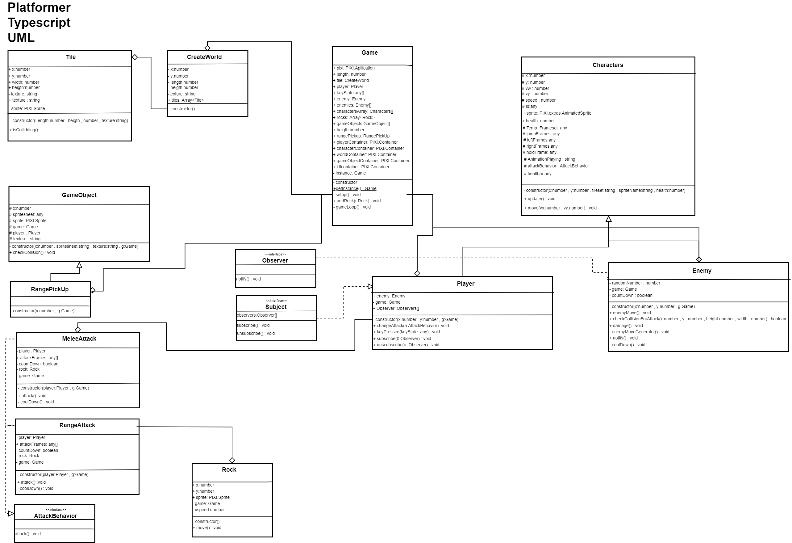

# How to start the game

Download/clone the game and run npm install

Speelbare link:https://roelvoordendag.github.io/platformer_typescript/

# How to build the game 

Type in your console npm run build to build the game

# Watcher and Webserver

When you want to run the webserver and the wactcher type npm run start

## Pull Reqeust Week 4 

Ik heb bij een Alwin een enemy toegevoegd aan zijn game die ook extends van de Character class. De enemy zelft beweegt random op basis 
van random getallen. De enemy kan hiermee ook niet uit het scherm gaan en blijft zo in het speelveld. Hierboven op heb ik er voor gezorgd dat 
de colliders meerdere vormen van players accepteren.

Ik vind dit handig omdat alwin nu al een basis enemy heeft in zijn game. Ik heb voor Alwin de basis opgezet en kan die zelf beslissen om wat voor manier hij hier verder mee wilt. 

https://github.com/AvanDriel/prg8game/pull/1

## Peer Review Week 6

Ik heb een peer review gedaan op Alwin's game de peer review kan je hier vinden:

https://github.com/AvanDriel/prg8game/issues/2

## Controls

Je kan rond bewegen met w,a en d. Je kan attacken door op de spatiebalk te drukken en je kan alle enemies tegelijk damgegen door op f te drukken.

## Singleton

## Strategy

## Observer

## UML

)

